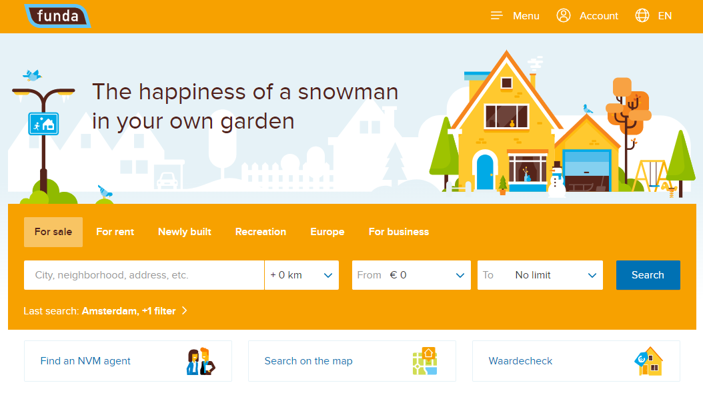
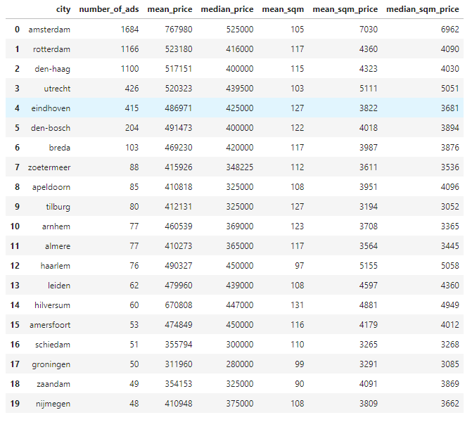

# Context

In this repository you can find:

* Scripts for scraping Funda.nl
* Data scraped from Funda.nl

The data was scraped from Funda.nl and contains house and apartment related data (e.g price and location, etc. See some of the columns descriptions later below).

# You can find the tabular data in the following path: 'data/data_clean.csv'

Some column description:

* 'address' : Street + house number
* 'postcode_city' : Postcode + City string
* 'postcode' : Only postcode
* 'city' : Location of the property on a city level
* 'ad_link' : Link which was used to scrape the data
* 'add_download_date_time' : Date time of
* 'Asking price' : Current price of the property
* 'Original asking price' : Original price of the property
* 'price' : cleaned asking price
* 'sqm_price': livingArea / price
* 'livingArea' : square meter size of the property
* 'Plot size' : the plot size of the property
* 'h_type' : apartment or house based on the 'ad_link' column
* 'Type apartment' : apartment type
* 'Number of stories' : how many stories a given property has

* ...

* 'Building type' :
* 'Year of construction' :
* 'Number of rooms' :
* 'Number of bath rooms' :
* etc.

# A short EDA can be found by opening the '03_eda.ipynb' notebook

You will see tables like this in the notebook:

# TODO

* put properties to map
* create model to estimate prices
